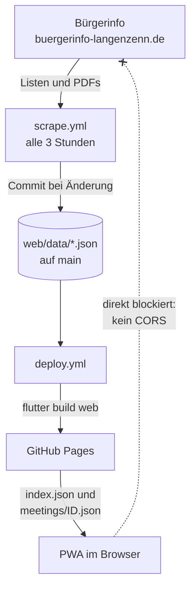
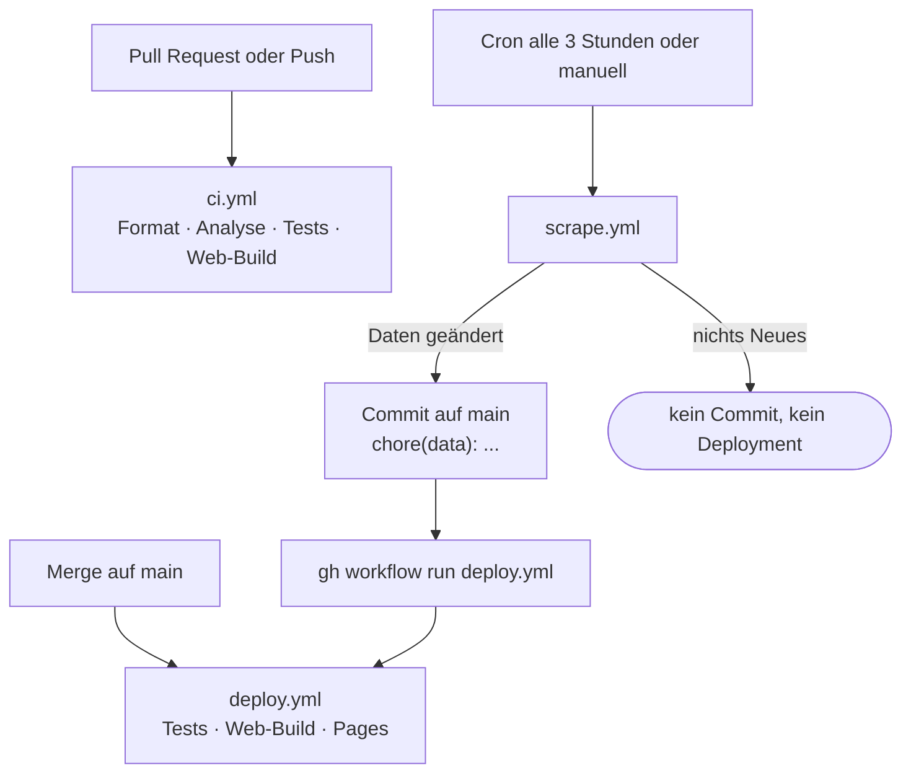
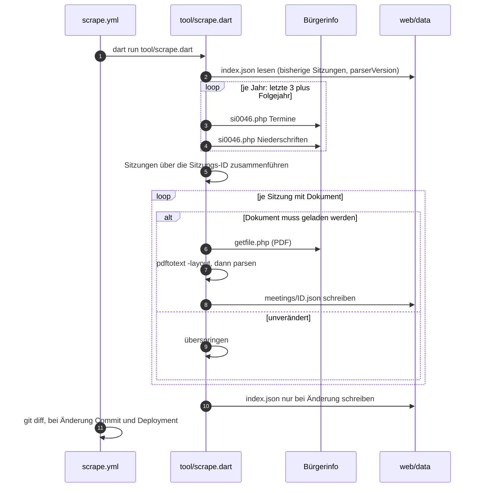
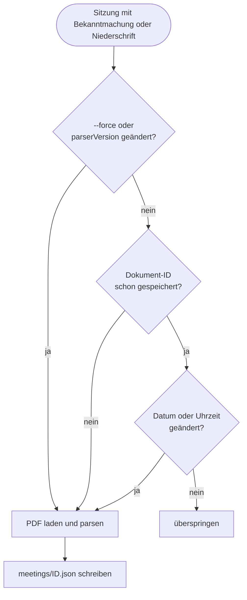
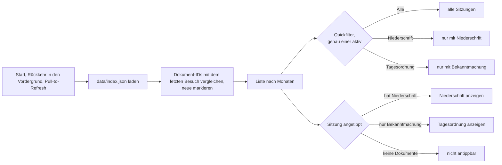

# Council

PWA für die Termine und Niederschriften des Langenzenner Stadtrats.

Die App zeigt alle Sitzungen als Liste, markiert Sitzungen mit Öffentlicher
Bekanntmachung und mit Niederschrift unterschiedlich und öffnet auf Tippen die
aufbereiteten Inhalte — Tagesordnung, Anwesenheit, Sachverhalt, Beschluss und
Abstimmungsergebnis. Über die Quickfilter „Alle“, „Niederschrift“ und
„Tagesordnung“ zeigt die Liste wahlweise alle Sitzungen oder nur die mit dem
jeweiligen Dokument; es ist immer genau ein Filter aktiv.

## Warum die Daten in der Pipeline eingelesen werden

Die Quelle ist das Bürgerinfo-System (SessionNet) unter
`buergerinfo-langenzenn.de`. Es sendet **keinen** `Access-Control-Allow-Origin`-Header.
Ein Klick auf einen Download-Link funktioniert im Browser (das ist eine
Navigation), aber der Seiten-Code darf die Bytes nicht lesen:

```
Access to fetch at 'https://www.buergerinfo-langenzenn.de/getfile.php?id=...'
from origin '...' has been blocked by CORS policy:
No 'Access-Control-Allow-Origin' header is present on the requested resource.
```

Eine PWA kann die PDFs deshalb nicht selbst einlesen. Statt einen fremden Proxy
dazwischenzuhängen, lädt und parst ein Dart-CLI die Dokumente in der GitHub
Action und legt das Ergebnis als JSON neben die App. Die App liest dieses JSON
von der eigenen Origin — ohne CORS, ohne PDF-Parsing im Browser, und jedes
Dokument wird einmal gelesen statt auf jedem Gerät erneut.

## Ablauf

### Überblick



Die PDFs werden in GitHub Actions gelesen, nicht im Browser. Die App lädt nur
das veröffentlichte JSON von der eigenen Origin.

### Workflows



| Workflow | Auslöser | Aufgabe |
| --- | --- | --- |
| `ci.yml` | Push, Pull Request | Format, Analyse, Unit- und Widget-Tests, Web-Build |
| `scrape.yml` | alle 3 Stunden, manuell | Sitzungen einlesen, Änderungen committen, Deployment anstoßen |
| `deploy.yml` | Push auf `main`, manuell | Tests, Web-Build, Veröffentlichung auf GitHub Pages |

Ein Push mit `GITHUB_TOKEN` startet keine weiteren Workflows. Deshalb stößt
`scrape.yml` das Deployment nach einem Daten-Commit selbst an.

### Ein Scrape-Lauf



### Wann ein Dokument geladen wird



`index.json` wird nur neu geschrieben, wenn sich Sitzungen, Quelle oder
Parser-Version ändern. Ohne neue Dokumente entsteht kein Commit.

### In der App



## Architektur

Feature-first, je Feature in Layer getrennt:

```
lib/
  app/                     Router, Theme, App-Einstieg
  core/                    Formatierung und geteilte Helfer
  features/meetings/
    domain/                Entities und Repository-Schnittstelle
    data/
      parsing/             HTML- und PDF-Text-Parser (rein, ohne Flutter)
      dtos/                JSON-Codecs, von App und Scraper genutzt
      datasources/         JSON von der eigenen Origin, "gesehen"-Speicher
      repositories/        Repository-Implementierung
    presentation/
      cubit/               MeetingsCubit, MeetingDetailCubit
      pages/               Liste und Detailansicht
      widgets/
tool/                      Scraper-CLI für die Pipeline
web/data/                  Veröffentlichte JSON-Daten (vom Scraper erzeugt)
```

State-Handling über `bloc` mit Cubits.

## Entwicklung

Die Flutter-Version steht nur in `.fvmrc`. VS Code (`.vscode/settings.json`)
und alle Workflows (`flutter-version-file`) lesen sie von dort.

```bash
fvm install
fvm flutter pub get
fvm flutter test
fvm flutter run -d chrome
```

Version wechseln mit `fvm use <version>`; das aktualisiert `.fvmrc` und die
VS-Code-Einstellung.

## Scraper

Braucht `pdftotext` aus poppler (`brew install poppler` bzw.
`apt-get install poppler-utils`).

```bash
fvm dart run tool/scrape.dart                    # letzte 3 Jahre plus Folgejahr
fvm dart run tool/scrape.dart --from-year=2020   # weiter zurück
fvm dart run tool/scrape.dart --force            # alles neu einlesen
```

Nach jeder Parser-Änderung `parserVersion` in
`lib/features/meetings/data/parsing/pdf_text.dart` erhöhen. Der nächste Lauf
liest dann alle Dokumente neu ein, damit die Korrektur auch bereits
gespeicherte Sitzungen erreicht.
